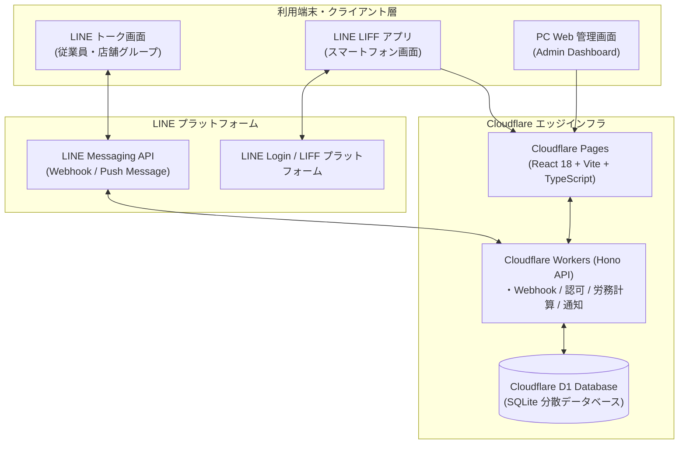
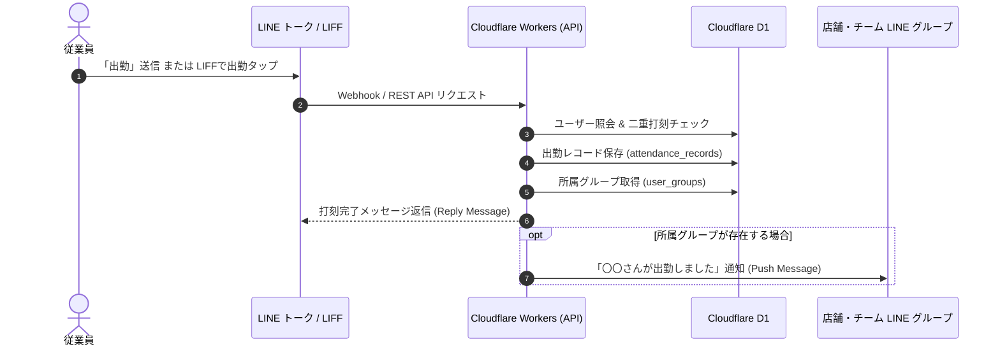

# kinntai（LINE連携スマート勤怠管理システム）

[](https://workers.cloudflare.com/)
[](https://developers.cloudflare.com/d1/)
[](https://developers.line.biz/ja/services/messaging-api/)
[](https://developers.line.biz/ja/services/liff/)
[](https://react.dev/)
[](https://www.typescriptlang.org/)

LINE（Messaging API / LIFF）と Cloudflare（Workers / D1 / Pages）を組み合わせた、サーバーレス＆クラウド完結型のスマート勤怠管理システムです。  
従業員は普段使い慣れた LINE のトークや LINE 内 Web アプリ（LIFF）からワンタップで打刻・申請を行い、管理者は PC の Web 管理画面やスマホの管理者モードからリアルタイムに勤怠集計、申請承認、CSV 出力、LINE サマリー配信を行えます。

---

## 目次

1. システムの特徴と解決する課題
2. システムアーキテクチャ
3. 業務シーケンス（LINE打刻・通知フロー）
4. 機能一覧
   - 4.1. LINE トーク・Bot 機能（Messaging API）
   - 4.2. LINE LIFF ダッシュボード（従業員向け）
   - 4.3. モバイル管理者モード（LIFF 内管理機能）
   - 4.4. PC 向け Web 管理画面（Admin Dashboard）
   - 4.5. LINE グループ自動学習・出勤通知制御
5. 勤怠・労務計算および運用ルール
   - 5.1. 自動休憩計算
   - 5.2. 平日の所定労働と振替休暇付与ルール
   - 5.3. 早出・早退の入力および承認運用
   - 5.4. 休日出勤の振替付与ルール
   - 5.5. 振替休暇の消化・消費運用
   - 5.6. 国民の祝日・振替休日の完全自動判定
6. CSV 出力・帳票仕様
7. セキュリティと認証仕様
8. データベース設計（D1 スキーマ）
9. 技術スタック
10. クイックスタート（環境構築から起動まで）
    - 10.1. 前提条件
    - 10.2. リポジトリのセットアップ
    - 10.3. Cloudflare D1 データベースの準備と初期データ投入
    - 10.4. 環境変数設定（フロントエンド & バックエンド）
    - 10.5. ローカル開発サーバーの起動
11. 本番デプロイ手順
12. ディレクトリ構成
13. 関連ドキュメント

---

## 1. システムの特徴と解決する課題

中小規模のチームや店舗運営において、「市販の勤怠管理 SaaS は高額で機能が過剰」「専用アプリのインストールやログインに従業員が抵抗感を持つ」「打刻忘れや休日の振替管理が煩雑」という課題が頻発します。本システムはこれらの課題を以下の強みで解決します。

- 導入障壁ゼロの UI/UX: 従業員は普段使っている LINE 公式アカウントに「出勤」「退勤」と送信するだけ。LINE 内 Web アプリ（LIFF）を開けば自動認証され、パスワードレスで全操作が完了します。
- サーバーレス＆超低運用コスト: Cloudflare Workers（エッジコンピューティング）と Cloudflare D1（エッジ SQLite）を採用。サーバー管理が一切不要で、無料枠または月額数十セント程度の極めて低コストで運用可能です。
- 実運用に即した精密な労務管理: 30分単位の早出・残業から自動算出される振替休暇（代休）システム、6時間超勤務の自動休憩控除、日本の国民の祝日（振替休日・国民の休日を含む）の完全自動判定を標準搭載。
- チームの透明性を高める LINE グループ通知: 店舗やチームの LINE グループに Bot を追加するだけでグループを自動学習。各スタッフが出勤・退勤した際にグループへ自動通知し、出勤状況をリアルタイムに共有できます。

---

## 2. システムアーキテクチャ

エッジファーストなアーキテクチャにより、世界中のエッジロケーションからサブミリ秒〜数ミリ秒の超低レイテンシで応答します。



---

## 3. 業務シーケンス（LINE打刻・通知フロー）

従業員が打刻してから所属グループへ通知されるまでの具体的なイベントフローです。



---

## 4. 機能一覧

### 4.1. LINE トーク・Bot 機能（Messaging API）

トーク画面上で手軽に勤怠操作が完結する機能群です。

- メッセージによる打刻:
  - 「出勤」と送信して即時打刻。すでに出勤済みの場合は二重打刻を防止し、打刻済み時刻を案内。
  - 「退勤」と送信して退勤打刻。未出勤時の退勤送信や二重退勤をガード。
  - 「休憩」「再開」などの送信時は、自動休憩計算（6時間超で60分自動控除）の運用ルールを自動返信。
- 自動ユーザー登録:
  - LINE 公式アカウントを友だち追加すると、LINE 表示名を取得して従業員アカウントを即時作成。案内メッセージを返信。
- LINE グループトーク対応:
  - Bot を社内や店舗の LINE グループに招待可能。
  - グループ内でメンバーが発言した「出勤」「退勤」を個別の LINE ユーザー ID から識別して正確に記録。
  - 打刻キーワード以外の通常会話には応答しない設計により、グループのコミュニケーションを妨げない。
- LINE プッシュ通知:
  - 申請通知: 従業員が休暇や打刻修正を申請した際、管理者 LINE へ即座にプッシュ通知。
  - 審査結果通知: 管理者が申請を承認または却下した際、結果および却下理由を申請者本人の LINE へプッシュ通知。
  - 月次サマリー送信: 管理画面から該当従業員の当月勤怠サマリーと CSV ダウンロードリンクを LINE トークへ直接配信。

### 4.2. LINE LIFF ダッシュボード（スマートフォン / 従業員向け）

LINE アプリ内で起動する Web ダッシュボードです（LIFF 環境下では LINE ログイン連携により自動ログイン）。

- 「今日」タブ:
  - リアルタイムデジタル時計（秒単位表示）。
  - 現在のステータス（未出勤 / 勤務中 / 退勤済み）と打刻ボタン。
  - 当日の打刻状況詳細（出勤・退勤時刻、休憩時間、実労働時間）。
  - 前日の退勤忘れ警告（前日未退勤の場合にアラートカードを表示）。
  - 振替休暇残高のリアルタイム表示（例: 2時間30分）。
  - 本日の業務備考（メモ）入力・即時保存機能。
- 「自分カレ」タブ（個人カレンダー）:
  - 自身の勤怠月間カレンダー表示（前月・翌月切り替え）。
  - 土曜（青）、日曜・祝日（赤）の自動色分け表示。日本の祝日名称を表示。
  - 日付セル上の打刻状態アイコン（勤務中、退勤済、休出、申請あり）。
  - 日付タップでその日の打刻詳細、労働時間、メモをポップアップ表示。
- 「社内カレ」タブ（社内全体カレンダー）:
  - 全従業員の休暇（全休・有休・欠勤）および短縮勤務（早退・遅出）を月間グリッドで俯瞰。
  - 従業員名の一文字を割り当てた色分け丸バッジ（全休: 赤、早退: 青、遅出: 紫）。
  - 社内イベントや共通メモがある日の右上グリーンマーカー表示。
  - 日付タップでカレンダー直下にインラインカードが展開され、その日の取得者一覧（フルネーム・時間・理由）や社内メモの確認・追加・削除が可能。
- 「履歴」タブ:
  - 当月の月次集計カード（総労働時間、残業時間、出勤日数、振替休暇残高）。
  - 日別勤怠履歴リスト（出退勤、休憩、実働、残業、休日出勤バッジ、メモ）。
- 「申請」タブ:
  - 休暇申請モーダル（種別: 有給休暇［全休］、振替休暇、欠勤）。
  - 振替休暇時のアクション選択（早退、遅出、全休［8h］）。
  - 振替休暇消化時間の指定（30分〜480分、30分刻み）と残高事前バリデーション。
  - 当日早退申請時の予定退勤時刻前制限チェック。
  - 打刻修正申請モーダル（対象日、修正後時刻、修正理由）。
  - 申請履歴一覧（申請中・承認済み・却下ステータス確認、却下理由の確認、申請中レコードの取消）。

### 4.3. モバイル管理者モード（LIFF 内管理機能）

管理者権限（role: admin）を持つユーザーが LIFF を開いた場合、画面右上のスイッチから「個人モード」と「管理者モード」を自由に切り替え可能です。

- 「申請一覧」タブ: 届いた全申請の確認（ステータス別フィルター: 申請中、承認済み、却下、すべて）、ワンタップ承認（勤怠データへ即時反映）、却下（理由入力対応）。
- 「従業員一覧」タブ: 全従業員の月次集計カード一覧、日別打刻詳細のアコーディオン展開、勤怠レコードの直接編集・新規登録・削除、月次サマリーの LINE 送信、月次勤怠 CSV の直接ダウンロード。
- 「社内カレンダー」タブ: 全体の休暇・短縮勤務の把握、社内イベント・共通メモの確認・新規登録・削除。

### 4.4. PC 向け Web 管理画面（Admin Dashboard）

PC ブラウザでの大画面操作に最適化された包括的管理画面です。

- 管理者ログイン: 管理者 ID / 名前とパスワードによる認証（Web Crypto API による SHA-256 ハッシュ暗号化照合）。
- 「勤怠管理」タブ:
  - 従業員一覧と月次サマリー（総労働時間、残業時間、出勤日数、振替残高）。
  - 従業員名のインクリメンタル検索・月切り替え（前月・当月・翌月）。
  - 全員分の月次勤怠 CSV 一括エクスポート。
  - 個別詳細ビュー（カレンダー / リスト表示切り替え、日別打刻編集、手動打刻追加、削除、個別 CSV 出力、LINE サマリー送信）。
  - 従業員アカウントの表示名変更および削除（関連データの一括カスケード削除）。
  - 所属 LINE グループの割り当て管理モーダル。
- 「申請管理」タブ: 全従業員の休暇申請・打刻修正申請の一元管理テーブル、ワンクリック承認・却下。
- 「社内カレンダー」タブ: 社内全体のスケジュール・休暇状況の月間一覧、社内共通メモの管理。
- ログアウト機能: 誤操作を防ぐ確認モーダル付きログアウト。

### 4.5. LINE グループ自動学習・出勤通知制御

店舗や事業所ごとの複数グループ運用を自動化する機能です。

- グループ情報の自動学習: Bot が招待されたグループ内でメッセージを受信した際、グループ ID とグループ名を自動取得して `line_groups` テーブルへ登録・更新。
- 所属グループの自動学習: 従業員がグループ内で発言（打刻を含む）した際、従業員とグループの所属関係を自動記録（`user_groups`）。
- 打刻時の自動通知: 個別トークや LIFF から出勤・退勤した際、所属している LINE グループへ自動で出退勤メッセージを送信。
- 手動グループ管理: 管理画面の「所属グループ設定」から、従業員ごとに通知先グループのチェックボックス選択が可能。

---

## 5. 勤怠・労務計算および運用ルール

### 5.1. 自動休憩計算

- 拘束時間（出勤から退勤まで）が 6 時間を超える場合、自動的に 60 分の休憩時間を控除して実労働時間を算出します。

### 5.2. 平日の所定労働と振替休暇付与ルール

- 所定労働時間は 9:00 - 18:00（実働 8 時間、休憩 1 時間）。
- 遅刻や早退による時間ペナルティは無し。
- 早出分（9:00 前の勤務時間）と残業分（18:00 以降の超過時間）のそれぞれについて、30分単位で切り捨てて振替休暇（代休）を付与します。

| 出退勤パターン | 早出計算（9:00前） | 残業計算（18:00以降） | 付与される振替休暇 | 備考 |
| :--- | :--- | :--- | :--- | :--- |
| 8:20 出勤 - 18:00 退勤 | 40分 → 30分付与 | 0分 | 30分（0.5h） | 早出40分のうち30分を認定 |
| 8:40 出勤 - 18:20 退勤 | 20分 → 0分 | 20分 → 0分 | 0分 | それぞれ30分未満のため切り捨て |
| 9:00 出勤 - 18:30 退勤 | 0分 | 30分 → 30分付与 | 30分（0.5h） | 30分残業 |
| 8:20 出勤 - 18:30 退勤 | 40分 → 30分付与 | 30分 → 30分付与 | 60分（1.0h） | 早出30分 + 残業30分 |
| 9:15 出勤 - 18:30 退勤 | 0分 | 30分 → 30分付与 | 30分（0.5h） | 遅刻ペナルティなし |
| 8:00 出勤 - 18:00 退勤 | 60分 → 60分付与 | 0分 | 60分（1.0h） | 早出60分 |
| 9:00 出勤 - 19:05 退勤 | 0分 | 65分 → 60分付与 | 60分（1.0h） | 65分のうち60分を認定 |

### 5.3. 早出・早退の入力および承認運用

- 早出（8:30 より前の出勤）:
  - 早出理由（メモ）の入力が必須（8:30〜9:00 の出勤は理由不要）。
- 早退（18:00 前の退勤）:
  - 早退理由（メモ）の入力が必須、かつ管理者による承認が必要。

### 5.4. 休日出勤の振替付与ルール

- 土曜・日曜・国民の祝日の出勤（打刻時に自動で休日出勤フラグを付与）。
- 勤務時間帯に関わらず、実労働時間を 30 分単位で切り捨てて付与。
  - 実労働 50 分 → 30 分付与
  - 実労働 80 分（1時間20分） → 60 分付与

### 5.5. 振替休暇の消化・消費運用

- 申請理由（コメント）の必須化: 振替時間を消費する際は理由入力が必須。
- 全休（1日全休）の残高制限: 振替休暇残高が 8 時間分（480分）ある場合のみ申請可能（480分未満は全休申請不可）。
- 当日の早上がり申請の時刻制限: 当日の早上がり申請は、早上がり予定時刻（18:00 - 短縮分数）より前であれば申請可能（予定時刻以降は申請不可）。
  - 例: 30分早上がりの場合、17:30 より前なら申請可能、17:30 以降は申請不可。
  - 例: 60分早上がりの場合、17:00 より前なら申請可能、17:00 以降は申請不可。
- 未来日（翌日以降）の事前指定申請: 翌日以降の日付については、希望日と短縮時間（30分単位または全休）を指定して事前に申請可能。
- 承認時の残高減算: 管理者が申請を承認した時点で、申請された分数（30分〜480分）が振替残高から減算。

### 5.6. 国民の祝日・振替休日の完全自動判定

日本の祝日法に基づき、フロントエンドおよびバックエンドの双方で自律計算エンジンを搭載（`src/holidays.ts` / `backend/src/holidays.ts`）。外部 API に依存せず永続的に動作します。

- 固定祝日: 元日、成人の日、建国記念の日、天皇誕生日、みどりの日、憲法記念日、こどもの日、山の日、文化の日、勤労感謝の日等。
- ハッピーマンデー: 成人の日（1月第2月曜）、海の日（7月第3月曜）、敬老の日（9月第3月曜）、スポーツの日（10月第2月曜）。
- 天文計算祝日: 春分の日、秋分の日を天文計算ロジックにより自動算出。
- 振替休日: 祝日が日曜日に重なった場合の翌月曜日以降の平日判定。
- 国民の休日: 祝日と祝日に挟まれた平日をオセロ方式で祝日化。

---

## 6. CSV 出力・帳票仕様

日本のビジネス現場（Excel）で直接開いても文字化けしないよう、「BOM 付き UTF-8（Byte Order Mark）」を採用しています。

### 出力フォーマット

1. 全員一括月次 CSV:
   - 日付、従業員名、出勤時刻、退勤時刻、休憩開始、休憩終了、実労働時間、残業時間、備考、休日出勤フラグ
2. 従業員別月次明細 CSV:
   - 帳票ヘッダー: 氏名、月度、総労働時間、残業時間、出勤日数、振替休暇残高
   - 明細行: 1日から末日までの全日付、曜日、勤務区分（出勤 / 休日出勤 / 有休 / 午前短縮 / 午後短縮 / 欠勤）、出勤時刻、退勤時刻、実働時間、備考

---

## 7. セキュリティと認証仕様

- パスワードハッシュ化: 管理者パスワードは Web Crypto API を用いた SHA-256 ハッシュ化を施し、平文パスワードはデータベースに保持しません。
- LINE Webhook 署名検証: LINE プラットフォームからの Webhook リクエストは、`x-line-signature` ヘッダーとチャネルシークレットを用いた HMAC-SHA256 署名検証を実施し、不正な偽装リクエストを完全遮断。
- LIFF 自動認証: LIFF アプリ起動時に LINE SDK 経由で取得した `userId` を検証し、なりすましを防止。
- ロールベース認可: 一般従業員（`employee`）と管理者（`admin`）の権限を厳格に分離。

---

## 8. データベース設計（D1 スキーマ）

Cloudflare D1 上で稼働するリレーショナルテーブル一覧です。

```text
users (従業員・管理者マスタ)
  ├── attendance_records (日別打刻レコード / 1ユーザー1日1件)
  ├── requests (休暇・打刻修正申請)
  ├── substitute_holidays (振替休暇付与・履歴)
  └── user_groups (所属関係中間テーブル)
        └── line_groups (Bot参加グループマスタ)

calendar_events (社内全体カレンダーメモ)
```

| テーブル名 | 主なカラム | 用途 |
| :--- | :--- | :--- |
| `users` | `id`, `name`, `role`, `line_user_id`, `password_hash` | ユーザーアカウント管理（管理者 / 従業員） |
| `attendance_records` | `id`, `user_id`, `date`, `clock_in`, `clock_out`, `memo`, `is_holiday_work` | 日々の出退勤打刻実績 |
| `requests` | `id`, `user_id`, `type`, `leave_type`, `date`, `substitute_minutes`, `substitute_action`, `clock_in`, `clock_out`, `reason`, `status`, `rejection_reason` | 有休・振休・欠勤および打刻修正申請 |
| `substitute_holidays`| `id`, `user_id`, `earned_date`, `used_date`, `days` | 振替休暇の付与および利用ログ |
| `line_groups` | `id`, `name`, `updated_at` | Bot が参加している LINE グループマスタ |
| `user_groups` | `user_id`, `group_id`, `updated_at` | ユーザーと LINE グループの所属関係 |
| `calendar_events` | `id`, `date`, `title`, `user_id`, `user_name`, `created_at` | 社内全体カレンダーの共有予定・メモ |

---

## 9. 技術スタック

| レイヤー | 技術 | 選定理由・特徴 |
| :--- | :--- | :--- |
| フロントエンド | React 18, TypeScript, Vite | 高速なビルド、型安全性、SPA 構成 |
| スタイリング | Vanilla CSS, Lucide React | フレームワーク依存のない高メンテナンス性、リッチなアイコン |
| バックエンド | Cloudflare Workers, Hono | コールドスタート数十ミリ秒の超高速エッジ API、REST & Webhook |
| データベース | Cloudflare D1 | サーバーレスエッジ RDBMS（SQLite ベース）、ゼロ構成レプリケーション |
| 静的ホスティング | Cloudflare Pages | グローバル CDN からの高速アセット配信 |
| LINE プラットフォーム | Messaging API, LIFF SDK v2 | トーク双方向通信、プッシュ通知、LINE ログイン自動認証 |
| 外部連携 | Web Crypto API | ブラウザおよびエッジ標準の安全なハッシュ計算 |

---

## 10. クイックスタート（環境構築から起動まで）

### 10.1. 前提条件

- Node.js 18.0.0 以上
- Cloudflare アカウント（無料枠で利用可能）
- LINE Developers アカウント（Messaging API および LINE ログインのチャネル作成）

### 10.2. リポジトリのセットアップ

```bash
git clone https://github.com/YOUR_GITHUB_USERNAME/kinntai.git
cd kinntai

# フロントエンドの依存インストール
npm install

# バックエンドの依存インストール
cd backend
npm install
cd ..
```

### 10.3. Cloudflare D1 データベースの準備と初期データ投入

1. Cloudflare D1 データベースを作成します。

```bash
cd backend
npx wrangler d1 create kinntai-db
```

出力された `database_name` と `database_id` を `backend/wrangler.toml` に設定します。

2. スキーマ（テーブル定義）を適用します。

```bash
# ローカル開発用
npx wrangler d1 execute kinntai-db --file=schema.sql --local

# リモート（本番用）
npx wrangler d1 execute kinntai-db --file=schema.sql --remote
```

3. 初期管理者ユーザー（admin）を投入します。

```bash
# パスワード 'admin123' の SHA-256 ハッシュ値: 240be518fabd2724ddb6f04eeb1da5967448d7e831c08c8fa822809f74c720a9
npx wrangler d1 execute kinntai-db --command="INSERT INTO users (id, name, role, password_hash) VALUES ('admin', '管理者', 'admin', '240be518fabd2724ddb6f04eeb1da5967448d7e831c08c8fa822809f74c720a9');" --local
```

### 10.4. 環境変数設定

#### フロントエンド（`.env`）

プロジェクトルートの `.env.example` をコピーして `.env` を作成します。

```bash
cp .env.example .env
```

```env
# ローカル開発時はローカルAPI、本番テスト時は本番Workers URLを指定
VITE_API_URL=http://127.0.0.1:8787
VITE_LIFF_ID=あなたのLIFF_ID
```

#### バックエンド（`backend/.dev.vars`）

`backend` ディレクトリの `.dev.vars.example` をコピーして `.dev.vars` を作成します。

```bash
cd backend
cp .dev.vars.example .dev.vars
```

```env
LINE_CHANNEL_ACCESS_TOKEN=あなたのMessaging_APIチャネルアクセストークン
LINE_CHANNEL_SECRET=あなたのMessaging_APIチャネルシークレット
```

### 10.5. ローカル開発サーバーの起動

ターミナルを2つ開いてフロントエンドとバックエンドをそれぞれ起動します。

ターミナル1（バックエンド API）:
```bash
cd backend
npm run dev
# http://127.0.0.1:8787 で起動
```

ターミナル2（フロントエンド Web）:
```bash
npm run dev
# http://localhost:5173 で起動
```

ブラウザで `http://localhost:5173` を開くと管理画面および勤怠画面を確認できます。

---

## 11. 本番デプロイ手順

### 1. バックエンドのシークレット登録とデプロイ

```bash
cd backend

# 本番環境用のシークレットを登録
npx wrangler secret put LINE_CHANNEL_ACCESS_TOKEN
npx wrangler secret put LINE_CHANNEL_SECRET

# 本番デプロイ
npx wrangler deploy --minify src/index.ts --config wrangler.toml
```

デプロイ完了時に表示される Worker URL（例: `https://kinntai-backend.your-subdomain.workers.dev`）を控えます。

### 2. フロントエンドのビルドと Cloudflare Pages へのデプロイ

プロジェクトルートの `.env` を本番 Worker URL に更新した上でデプロイします。

```bash
# プロジェクトルートで実行
npm run build
npx wrangler pages deploy dist --project-name=kinntai-frontend
```

### 3. LINE Developers の設定

1. Webhook URL: `https://[あなたのWorkerドメイン]/webhook` を設定し、「Webhookの利用」をオンにします。
2. LIFF エンドポイント URL: Cloudflare Pages の公開 URL（またはカスタムドメイン）を設定します。

---

## 12. ディレクトリ構成

```text
kinntai/
├── .env.example              # フロントエンド環境変数テンプレート
├── DEPLOYMENT_GUIDE.md       # 本番デプロイ＆LINE詳細設定ガイド
├── README.md                 # プロジェクト総合ドキュメント（本ファイル）
├── backend/                  # バックエンド（Cloudflare Workers + D1）
│   ├── .dev.vars.example     # バックエンド開発用シークレットテンプレート
│   ├── package.json          # バックエンド依存設定
│   ├── schema.sql            # D1 データベーススキーマ定義
│   ├── src/
│   │   ├── holidays.ts       # 祝日・休日判定エンジン（サーバー用）
│   │   └── index.ts          # Hono REST API & LINE Webhook ハンドラー
│   └── wrangler.toml         # Workers & D1 定義ファイル
├── public/                   # 静的アセット
│   ├── favicon.svg           # ファビコン
│   ├── icon-192.png          # PWA アイコン（192px）
│   ├── icon-512.png          # PWA アイコン（512px）
│   ├── manifest.json         # PWA マニフェスト設定
│   └── richmenu.png          # LINE リッチメニュー用画像（3分割テンプレート）
├── src/                      # フロントエンド（React 18 + TypeScript）
│   ├── components/
│   │   ├── AdminDashboard.tsx# PC 向け管理者ダッシュボード
│   │   ├── CalendarView.tsx  # カレンダーグリッド表示コンポーネント
│   │   ├── LiffDashboard.tsx # スマホ / LINE 向け LIFF ダッシュボード
│   │   ├── Login.tsx         # 管理者認証コンポーネント
│   │   ├── Modal.tsx         # 共通モーダルダイアログ
│   │   └── MonthNavigator.tsx# 月切り替えバー
│   ├── apiStore.ts           # REST API 通信・勤怠集計ロジック層
│   ├── csvExport.ts          # BOM 付き UTF-8 CSV 生成・ダウンロード
│   ├── holidays.ts           # 祝日・休日判定エンジン（フロント用）
│   ├── index.css             # デザインシステム・レスポンシブスタイル
│   ├── liff.ts               # LINE LIFF SDK 初期化・認証モジュール
│   ├── main.tsx              # React エントリーポイント
│   ├── store.ts              # オフライン・モック用ストア
│   └── types.ts              # 共通 TypeScript 型定義
├── index.html                # HTML エントリーポイント
├── package.json              # フロントエンド依存・スクリプト定義
└── vite.config.ts            # Vite ビルド設定
```

---

## 13. 関連ドキュメント

- [デプロイ＆実用化運用ガイド](./DEPLOYMENT_GUIDE.md): LINE 公式アカウントの応答設定、リッチメニュー登録、Webhook 接続テスト手順の解説。
