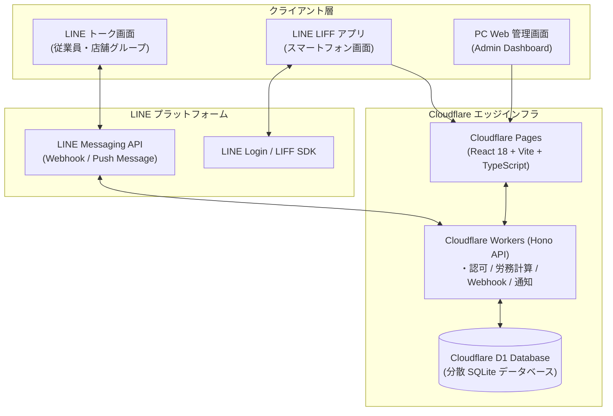
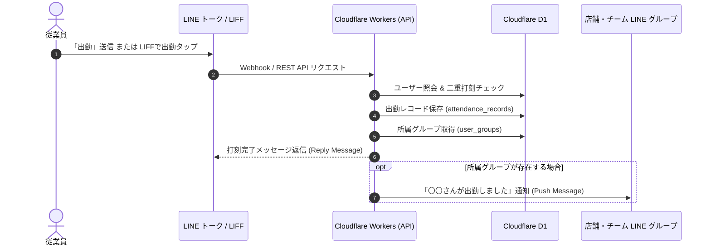

# kinntai（LINE連携スマート勤怠管理システム）

[](https://workers.cloudflare.com/)
[](https://developers.cloudflare.com/d1/)
[](https://developers.line.biz/ja/services/messaging-api/)
[](https://developers.line.biz/ja/services/liff/)
[](https://react.dev/)
[](https://www.typescriptlang.org/)

LINE（Messaging API / LIFF）と Cloudflare（Workers / D1 / Pages）をフル活用した、サーバーレス＆クラウド完結型のスマート勤怠管理システムです。  
従業員は使い慣れた LINE トークや LINE 内 Web アプリ（LIFF）からワンタップで打刻・申請を完結でき、管理者は PC 管理画面やスマホからリアルタイム集計、承認、CSV 出力、LINE サマリー配信を行えます。

---

## 1. 開発の背景と解決した課題

### 開発の背景：身近な現場の課題を技術で解決する
実家で現場を営む親の勤怠・労務管理を手作業から効率化するために開発しました。  
親や現場スタッフはITツールの操作に不慣れで、「新しい専用アプリのインストール」「ID・パスワードでのログイン」「複雑な管理画面」といった運用は操作に迷って定着しないという強い懸念がありました。また、市販の勤怠 SaaS は小規模な現場には高額で機能が過剰なケースが多いのが実情でした。  
そこで、「普段から連絡用として毎日使い慣れている LINE だけで、一切の学習コストなく直感的に完結する勤怠システム」をコンセプトに設計・実装しました。

### 解決した課題とアプローチ
- 学習コスト・導入障壁ゼロの UI/UX:
  従業員は普段使っている LINE 公式アカウントに「出勤」「退勤」と送るだけ。LINE 内 Web アプリ（LIFF）を開けば自動認証され、パスワードレスで全操作が完了します。
- サーバーレス＆超低運用コスト:
  Cloudflare Workers（エッジ API）と Cloudflare D1（エッジ SQLite）を採用。サーバー保守の手間を不要にし、小規模運用であれば実質無料枠（数十円/月以下）で維持できるコストパフォーマンスを実現しました。
- 実運用に即した精密な労務ロジック:
  30分単位の早出・残業から自動算出される振替休暇（代休）システム、6時間超勤務の自動休憩控除、日本の祝日（振替休日・国民の休日含む）自律判定を搭載。
- LINE グループ自動学習:
  現場の LINE グループに Bot を招待するだけでグループを自動認識し、出勤状況をリアルタイムに自動共有。

---

## 2. システムアーキテクチャ

エッジファーストなアーキテクチャにより、世界中のエッジロケーションから超低レイテンシで応答します。



### 業務シーケンス（LINE打刻・通知フロー）

従業員が打刻してから所属グループへ通知されるまでのイベントフローです。



---

## 3. 主要機能ハイライト

### 従業員向け（LINE & LIFF）
- LINE トーク打刻: 「出勤」「退勤」と送信するだけで打刻完了。二重打刻防止ガード付き。
- グループ出勤通知: 個別トークや LIFF で打刻すると、所属する店舗・チームの LINE グループへ自動通知。
- LIFF ダッシュボード: リアルタイムデジタル時計、前日未退勤アラート、振替残高の即時表示。
- 個人カレンダー & 社内カレンダー: 自身の打刻履歴に加え、同僚の休暇・早退状況や社内イベントを一覧確認。
- 申請ワークフロー: 有給・振替休暇（全休・早退・遅出）・打刻修正をスマホから手軽に申請。

### 管理者向け（PC Web & モバイル）
- リアルタイム集計: 総労働時間、残業時間、出勤日数、振替残高の月次自動集計。
- 申請承認・却下: 届いた申請をワンクリックで承認（勤怠データへ即時反映）または却下（理由入力対応）。
- 帳票出力 & 配信: Excel で文字化けしない BOM 付き UTF-8 CSV エクスポート、および対象従業員への LINE 月次サマリー送信。
- 権限管理: 一般従業員と管理者を分離し、管理者パスワードは SHA-256 で暗号化保護。

---

## 4. 技術スタックと選定理由

| レイヤー | 技術 | 選定理由・技術的メリット |
| :--- | :--- | :--- |
| バックエンド | Cloudflare Workers, Hono | コールドスタート数十ミリ秒の超高速エッジ API。軽量かつ型安全なルーター。 |
| データベース | Cloudflare D1 | サーバーレスエッジ RDBMS（SQLite ベース）。ゼロ構成で高可用性を実現。 |
| フロントエンド | React 18, TypeScript, Vite | 型安全な開発体験、コンポーネント指向、高速なビルドと軽量バンドル。 |
| スタイリング | Vanilla CSS, Lucide React | フレームワークに依存しない高い保守性と、統一感のあるモダン UI。 |
| LINE 連携 | Messaging API, LIFF SDK v2 | 業務連絡基盤としての LINE 活用、およびユーザーのログイン負担をゼロにする自動認可。 |

---

## 5. 技術的な工夫・アピールポイント

- 外部 API 非依存の祝日判定エンジン:
  日本の祝日法に基づき、春分・秋分の天文計算、ハッピーマンデー、振替休日、国民の休日を完全内製化（フロント・バック両系に搭載）。外部サービス障害の影響を受けません。
- 状態に依存しない堅牢な労務計算:
  出勤・退勤の打刻データから 30分単位の早出・残業・休日出勤を動的に算出して振替残高を算出。ステートレスで不整合が起きないロジック設計を採用。
- HMAC-SHA256 による Webhook 検証:
  LINE プラットフォームからの全リクエストに対して署名検証を実施し、不正アクセスやなりすましを防止。

---

## 6. クイックスタート

### 1. リポジトリのセットアップ
```bash
git clone https://github.com/daigato/kintai.git
cd kintai
npm install
cd backend && npm install && cd ..
```

### 2. 環境変数の設定
```bash
cp .env.example .env
cp backend/.dev.vars.example backend/.dev.vars
```

### 3. ローカル開発サーバー起動
```bash
# ターミナル1: バックエンド API (ポート 8787)
cd backend && npm run dev

# ターミナル2: フロントエンド Web (ポート 5173)
npm run dev
```

---

## 7. ドキュメント一覧

システムの詳細な設計・運用手順については、以下のドキュメントをご参照ください。

- [業務仕様および詳細設計書 (SPECIFICATION.md)](SPECIFICATION.md): 労務計算ロジック、CSV仕様、DBスキーマの詳細
- [デプロイ＆実用化運用ガイド (DEPLOYMENT_GUIDE.md)](DEPLOYMENT_GUIDE.md): Cloudflare 本番デプロイ手順、LINE コンソール設定、リッチメニュー設置ガイド
